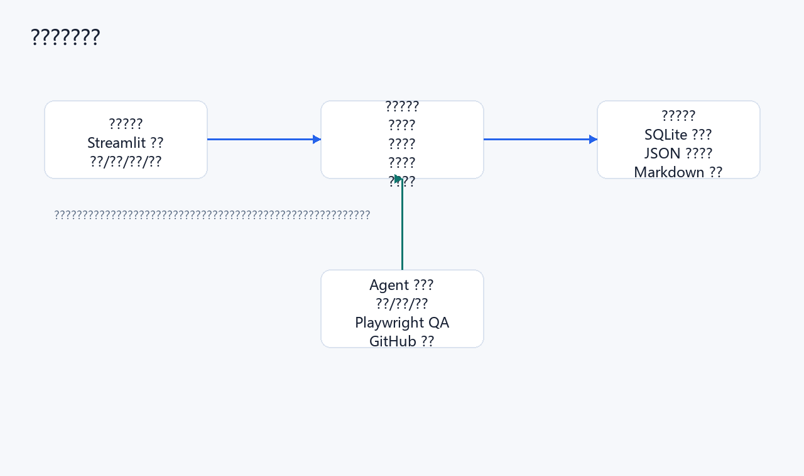
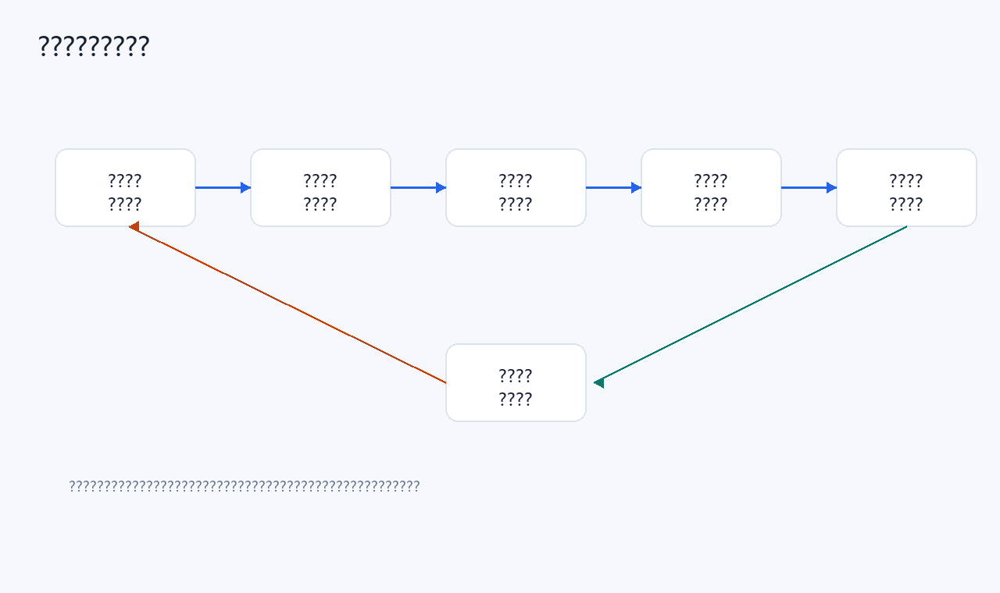
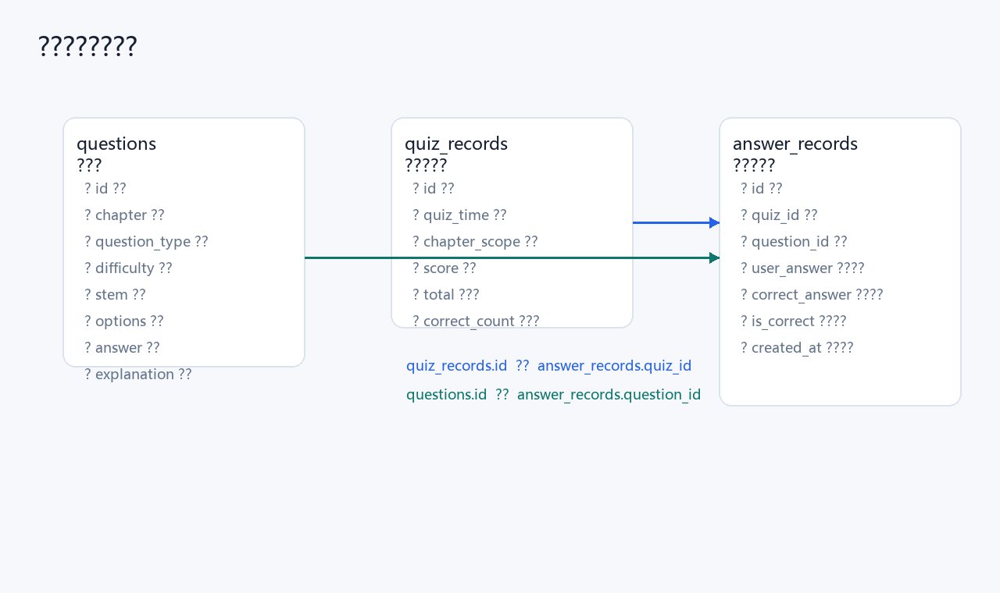
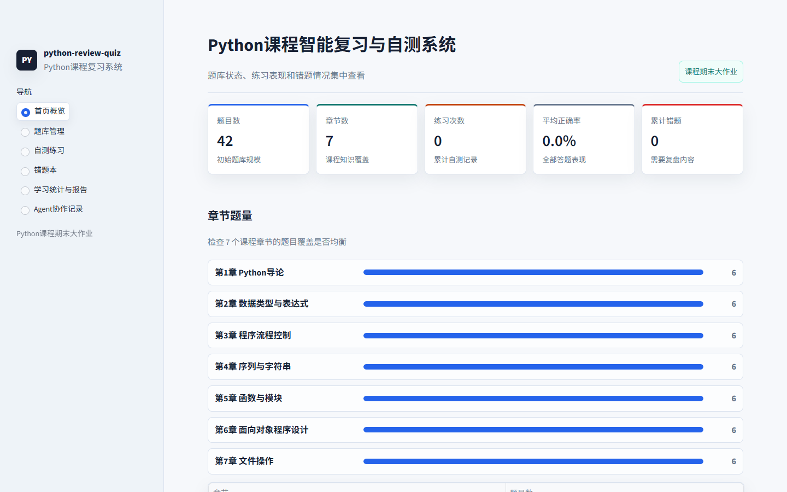
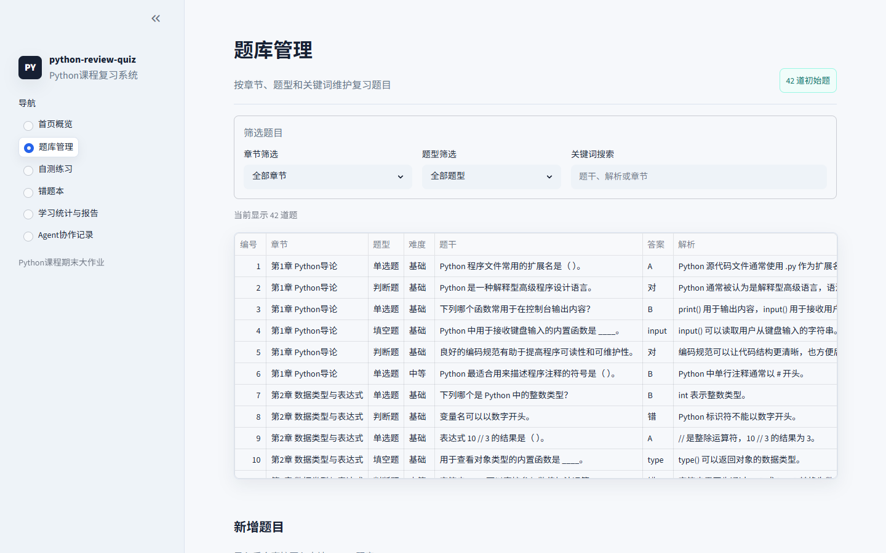
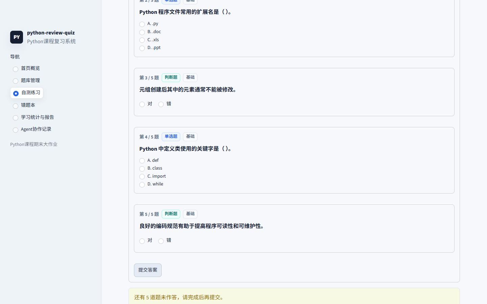
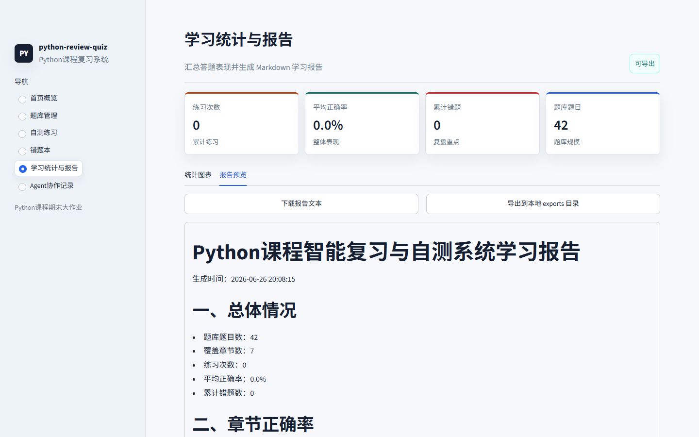
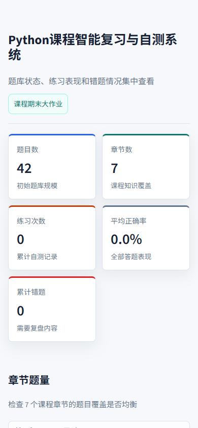

# Python程序设计课程设计报告

论文题目：Python课程智能复习与自测系统设计与实现

学生姓名：__________

学号：__________

专业班级：__________

指导教师：__________

学院：__________

完成时间：2026年6月26日

---

# 目 录

摘要

Abstract

1. 引言

2. 开发工具介绍

3. 系统需求分析与总体设计

4. 系统模块功能实现与实验步骤

5. 测试、结果与维护

6. 讨论与改进方向

7. 结束语

参考文献

附录：大模型 Agent 协作记录摘要

---

# 摘要

随着 Python 课程学习内容的逐渐增多，学生在期末复习阶段常常需要面对知识点分散、错题复盘不及时、练习记录难以统计等问题。为了提高课程复习效率，并综合运用 Python 程序设计课程中学习到的基础语法、数据结构、函数、模块、面向对象、文件操作、数据库操作和可视化界面开发等知识，本文设计并实现了一个基于 Streamlit 与 SQLite 的 Python 课程智能复习与自测系统。

该系统围绕课程复习场景展开，主要包括题库管理、自测练习、自动判分、错题记录、学习统计、报告导出和 Agent 协作记录等功能模块。系统使用 JSON 文件保存初始题库，使用 SQLite 数据库存储题目、练习记录和答题明细，使用 Streamlit 构建交互式页面，并通过 Markdown 方式导出学习报告。项目开发过程中引入大模型 Agent 参与需求分析、方案规划、代码实现、测试调试、前端优化和报告整理，形成了较完整的人机协作开发过程。

实验结果表明，系统能够完成题库筛选、新增题目、随机抽题、自测判分、未作答检测、错题保存、统计展示和报告导出等核心任务。通过单元测试、语法检查和 Playwright 交互式页面测试，验证了系统功能的正确性和界面展示的可用性。本文最后对系统实现过程中的问题、解决方案、大模型 Agent 应用方式及后续改进方向进行了讨论。

关键词：Python；Streamlit；SQLite；课程复习；自动判分；大模型 Agent

# Abstract

With the increase of Python course knowledge points, students often face scattered review materials, delayed wrong-answer review and insufficient learning statistics during final exam preparation. This project designs and implements an intelligent review and self-test system for a Python programming course based on Streamlit and SQLite.

The system includes question bank management, quiz practice, automatic grading, wrong-answer recording, learning statistics, report exporting and Agent collaboration records. JSON is used for initial question data, SQLite is used for persistent storage, and Streamlit is used to build the interactive user interface. During development, a large language model Agent was used for requirement analysis, planning, coding, testing, UI polishing and report preparation.

Experimental results show that the system can complete the main review workflow, including question filtering, random quiz generation, answer checking, wrong-answer review and report generation. Unit tests, syntax checks and Playwright-based UI tests were conducted to verify the correctness and usability of the system.

Keywords: Python; Streamlit; SQLite; Review System; Automatic Grading; Large Language Model Agent

# 1. 引言

## 1.1 研究背景

Python 语言具有语法简洁、生态丰富、应用范围广等特点，已经成为程序设计课程中的重要教学语言。对于初学者而言，Python 课程通常包括基础语法、数据类型、流程控制、序列与字符串、函数与模块、面向对象程序设计和文件操作等内容。这些内容既有概念性知识，也有实践性较强的代码操作。临近期末时，如果仅依靠课堂 PPT 或纸质笔记复习，容易出现知识点遗漏、错题无法集中管理、学习效果无法量化等问题。

传统复习方式主要依赖人工整理题目和手动核对答案，虽然形式简单，但存在效率低、统计困难、反馈不及时等不足。随着 Web 技术和轻量级数据存储技术的发展，使用 Python 构建一个小型复习与自测系统，既能够提高复习效率，也能够体现课程所学知识的综合应用价值。

## 1.2 课题意义

本课程设计选择“Python课程智能复习与自测系统”作为实现对象，具有以下意义：

1. 面向真实学习场景，能够帮助学生进行章节复习、自测练习和错题回顾。
2. 综合运用 Python 课程中的基础知识，包括变量、函数、类、模块、文件、JSON、SQLite 和异常处理等。
3. 使用 Streamlit 构建可视化交互界面，使系统具有较好的演示效果。
4. 将大模型 Agent 作为辅助开发工具，体现对智能工具规划、使用和验证能力的理解。
5. 通过测试记录、问题修复记录和 GitHub 版本管理，提高课程设计过程的规范性。

## 1.3 设计目标

本系统的总体目标是实现一个可运行、可演示、可测试、可扩展的 Python 课程复习平台。具体目标如下：

1. 建立覆盖 Python 课程主要章节的初始题库。
2. 支持题库查询、筛选和新增题目。
3. 支持按章节随机抽题并形成自测试卷。
4. 支持单选题、判断题和填空题的自动判分。
5. 支持未作答检测，避免用户误提交。
6. 自动保存练习记录和错题明细。
7. 根据练习记录生成学习统计和 Markdown 学习报告。
8. 记录大模型 Agent 在项目规划、开发、测试和优化中的使用过程。

# 2. 开发工具介绍

## 2.1 Python 简介

Python 是一种解释型、面向对象、动态数据类型的高级程序设计语言。Python 语法简洁，具有较高的可读性，适合初学者学习程序设计思想。在本系统中，Python 作为主要开发语言，承担了数据建模、业务逻辑处理、数据库读写、报告生成和测试执行等任务。

本项目中使用到的 Python 基础知识包括：

1. 字符串、列表、字典等基本数据类型。
2. 条件语句和循环语句。
3. 函数定义与模块化组织。
4. 类与对象，用于封装题目、答题结果和练习记录。
5. 文件操作和 JSON 数据读取。
6. SQLite 数据库操作。
7. 单元测试和异常处理。

## 2.2 Streamlit 简介

Streamlit 是一个面向数据应用和轻量级 Web 工具的 Python 框架。它可以用较少的代码构建交互式页面，非常适合课程设计、数据分析工具和原型系统。本项目使用 Streamlit 构建系统前端界面，包括侧边栏导航、表单、按钮、表格、下载按钮、提示信息和报告预览等。

与传统 Web 开发方式相比，Streamlit 不需要单独编写 HTML、CSS 和 JavaScript 即可完成页面交互。但为了提高课程设计展示效果，本系统在 Streamlit 基础上加入了自定义 CSS 样式，包括侧边栏品牌区、页面标题、指标卡、题目卡片、题型标签和 CSS 条形图等，使页面更符合完整作品的展示要求。

## 2.3 SQLite 简介

SQLite 是一种轻量级关系型数据库，具有文件化、免安装、易部署等特点。对于课程设计项目而言，SQLite 不需要额外配置数据库服务器，适合保存题库、练习记录和答题明细。

本系统使用 SQLite 建立三张核心表：题目表、练习记录表和答题明细表。通过这些表，系统能够实现题库管理、练习历史保存、错题查询和统计分析等功能。

## 2.4 JSON 与 Markdown

JSON 是一种轻量级数据交换格式，适合保存结构化数据。本系统使用 `data/seed_questions.json` 保存初始题库，应用首次启动时自动读取该文件并导入 SQLite 数据库。

Markdown 是一种轻量级标记语言，适合生成文本报告。本系统使用 Markdown 生成学习报告，并支持下载和导出。最终课程设计报告也保留了 Markdown 版本，方便后续修改。

## 2.5 大模型 Agent 与辅助工具

本课程设计的特殊要求之一是鼓励并考察大模型 Agent 的使用能力。本项目使用 Codex 作为大模型 Agent，辅助完成项目规划、代码实现、测试调试、前端优化、GitHub 同步和报告撰写等任务。同时使用 GitHub 插件、Playwright 工具、文档处理能力和本地命令行工具对项目进行管理和验证。

大模型 Agent 在本项目中的作用不是简单代写代码，而是作为一个协作开发助手：先根据用户目标进行项目拆解，再按照计划实施，并在每一步保留提示词、决策理由和验证记录。这种方式使项目过程更清晰，也便于在课程设计报告中说明开发方法。

表2-1列出了本项目主要开发工具。

| 工具或库 | 用途 | 在项目中的作用 |
| --- | --- | --- |
| Python | 主开发语言 | 编写业务逻辑、数据库操作、测试和报告生成 |
| Streamlit | Web 界面框架 | 构建首页、题库、自测、错题本和统计页面 |
| SQLite | 轻量级数据库 | 保存题目、练习记录和答题明细 |
| JSON | 初始数据文件 | 保存课程初始题库 |
| Markdown | 文档与报告格式 | 生成学习报告和课程设计文档 |
| unittest | 自动化测试 | 验证答案判断、判分、报告导出等功能 |
| Playwright | 页面测试工具 | 验证页面加载、交互流程和移动端显示 |
| Git/GitHub | 版本管理 | 记录开发过程并同步远程仓库 |
| Codex Agent | 大模型开发助手 | 辅助规划、编码、调试、优化和报告撰写 |

# 3. 系统需求分析与总体设计

## 3.1 需求分析

系统主要面向正在复习 Python 程序设计课程的学生。用户希望能够根据章节查看题目，通过自测检验掌握情况，并根据错题和统计结果调整复习重点。因此，系统应满足以下需求。

功能需求如下：

1. 题库管理：系统能够展示题目列表，并支持按章节、题型和关键词筛选题目。
2. 新增题目：用户可以在页面中录入题干、选项、答案和解析。
3. 自测练习：用户可以选择章节和题量，系统随机抽取题目组成练习。
4. 自动判分：提交答案后，系统自动判断正确与否并计算成绩。
5. 未答检测：若仍有题目未作答，系统提示用户继续完成，不保存成绩。
6. 错题记录：系统自动保存错误答案，便于后续复盘。
7. 学习统计：系统根据答题明细统计正确率、错题数量和章节表现。
8. 报告导出：系统能够生成 Markdown 学习报告。
9. Agent 记录：系统展示项目开发中的关键提示词和协作过程。

非功能需求如下：

1. 系统应易于安装和运行。
2. 界面应清晰、简洁，适合课堂展示。
3. 数据应能够持久保存。
4. 核心功能应有自动化测试支撑。
5. 项目文档应完整，便于形成课程设计报告。

## 3.2 系统功能结构

本系统采用模块化设计，将页面展示、业务逻辑、数据存储和报告导出分离。主要功能模块见表3-1。

| 模块名称 | 功能说明 | 对应文件 |
| --- | --- | --- |
| 首页概览模块 | 展示题目数、章节数、练习次数、正确率、错题数和章节题量 | `app.py` |
| 题库管理模块 | 支持题目筛选、关键词搜索和新增题目 | `src/question_bank.py` |
| 自测练习模块 | 随机抽题、提交答案、未答检测和自动判分 | `src/quiz_engine.py` |
| 错题本模块 | 查询错题记录，并支持从错题生成回练 | `src/record_manager.py` |
| 学习统计模块 | 统计章节正确率、错题分布和总体情况 | `src/statistics_service.py` |
| 报告导出模块 | 生成 Markdown 学习报告并导出到本地 | `src/report_exporter.py` |
| 数据模型模块 | 定义题目、答题明细和练习记录数据结构 | `src/models.py` |
| 测试模块 | 对模型、题库、自测和报告导出进行测试 | `tests/` |
| Agent 文档模块 | 记录人机协作提示词、采纳内容和验证结果 | `docs/06_Agent协作记录.md` |

系统总体架构如图3-1所示。



图3-1 系统总体架构图

## 3.3 业务流程设计

系统的核心流程是自测练习。用户进入自测页面后，先选择章节和题量，系统从题库中随机抽取题目。用户作答后提交，系统先判断是否存在未作答题目。如果存在未作答题目，则给出提示，不保存成绩；如果全部完成，则进入自动判分流程，将成绩和答题明细保存到数据库中。错误题目会被自动纳入错题本，供用户后续回练。

自测练习业务流程如图3-2所示。



图3-2 自测练习业务流程图

## 3.4 数据库设计

系统采用 SQLite 数据库，数据库文件为 `data/review_quiz.sqlite3`。数据库核心表包括 `questions`、`quiz_records` 和 `answer_records`。其中 `questions` 存储题库题目，`quiz_records` 存储每一次练习的总体结果，`answer_records` 存储每道题的答题明细。

数据库关系如图3-3所示。



图3-3 数据库关系设计图

主要数据表说明见表3-2。

| 数据表 | 主要字段 | 说明 |
| --- | --- | --- |
| `questions` | `id`、`chapter`、`question_type`、`difficulty`、`stem`、`options`、`answer`、`explanation` | 保存题目基本信息 |
| `quiz_records` | `id`、`quiz_time`、`chapter_scope`、`score`、`total`、`correct_count` | 保存每次练习的总体成绩 |
| `answer_records` | `id`、`quiz_id`、`question_id`、`user_answer`、`correct_answer`、`is_correct`、`created_at` | 保存每道题的作答结果 |

## 3.5 大模型 Agent 协作设计

本项目将大模型 Agent 的使用纳入系统开发流程，而不是仅作为临时问答工具。Agent 协作流程主要包括：

1. 用户提出课程设计目标和约束。
2. Agent 分析样例报告、课程 PPT 和项目范围。
3. 用户与 Agent 共同确定项目题目和功能边界。
4. Agent 按照计划实现系统，并记录关键提示词。
5. Agent 使用测试工具检查代码和页面。
6. 用户根据结果提出继续优化要求。
7. Agent 将每轮协作整理到文档中，作为最终报告素材。

通过这种方式，系统不仅展示了 Python 编程能力，也体现了对大模型 Agent 的规划、调用、验证和反思能力。

# 4. 系统模块功能实现与实验步骤

## 4.1 实验环境与运行步骤

本项目的本地运行环境如下：

| 项目 | 内容 |
| --- | --- |
| 操作系统 | Windows |
| 开发语言 | Python |
| 界面框架 | Streamlit |
| 数据库 | SQLite |
| 测试工具 | unittest、compileall、Playwright |
| 版本管理 | Git、GitHub |

系统运行步骤如下：

1. 进入项目目录。

```bash
cd D:\Desktop\课程文件夹\python\期末大作业
```

2. 安装项目依赖。

```bash
python -m pip install -r requirements.txt
```

3. 启动 Streamlit 应用。

```bash
python -m streamlit run app.py
```

4. 在浏览器中访问系统。

```text
http://localhost:8501
```

5. 首次启动时，系统自动创建数据库，并从 `data/seed_questions.json` 导入初始题库。

6. 通过侧边栏进入不同模块，完成题库管理、自测练习、错题复盘、学习统计和报告导出。

## 4.2 首页概览模块实现

首页用于展示系统总体运行状态，包括题目数、章节数、练习次数、平均正确率、累计错题数和章节题量。为了提高展示效果，首页采用自定义指标卡和 CSS 条形列表，使信息层次更加清晰。

系统首页如图4-1所示。



图4-1 系统首页概览

首页中显示当前题库包含 42 道题，覆盖 7 个课程章节。章节题量图表能够直观展示各章节题目数量是否均衡。与早期版本相比，最终版本去除了 Altair/Vega 图表依赖，改用 CSS 条形列表，避免了控制台 warning，同时保持了可视化效果。

## 4.3 题库管理模块实现

题库管理模块支持按章节、题型和关键词筛选题目，也支持新增题目。用户可以录入章节、题型、难度、题干、选项、答案和解析。系统在保存题目前会进行基本校验，例如题干和答案不能为空，单选题至少需要两个选项。

题库管理界面如图4-2所示。



图4-2 题库管理界面

题库模块使用 `Question` 数据模型封装题目信息，使用 `question_bank.py` 完成数据库增删查操作。题目选项以 JSON 字符串形式保存到 SQLite 数据库中，读取时再解析为 Python 列表。

## 4.4 自测练习模块实现

自测练习模块是系统核心模块。用户可以选择章节和题量，点击“开始自测”后系统随机抽取题目。每道题以卡片形式显示，并标注题号、题型和难度。系统支持单选题、判断题和填空题三类题型。

为了避免用户误提交，系统取消了选择题和判断题的默认选中状态。提交时先调用 `find_unanswered_questions()` 检查是否有未作答题目。如果存在未作答题目，系统提示用户继续完成，不保存练习记录。该功能提高了自测结果的可靠性。

自测未作答提示如图4-3所示。



图4-3 自测未作答提示

自动判分主要依据题型进行处理。单选题忽略大小写，判断题支持“对、错、正确、错误、true、false”等常见表达，填空题会去除前后空格并进行大小写处理。判分后，系统会生成答题明细，并保存到数据库。

## 4.5 错题本模块实现

错题本模块根据 `answer_records` 表中 `is_correct=0` 的记录生成。用户可以按章节筛选错题，查看自己的答案、正确答案和题目解析。系统还支持从错题中生成回练题目，使用户能够针对薄弱知识点进行再次练习。

错题本的设计思路是：不只记录“错了几道题”，还要保留“错在哪里”。因此答题明细表中同时保存用户答案、正确答案、题目编号和创建时间，便于后续统计和复盘。

## 4.6 学习统计与报告模块实现

学习统计模块汇总练习次数、平均正确率、累计错题和题库规模，并以图表和表格形式展示章节正确率、错题分布等信息。报告模块能够生成 Markdown 学习报告，支持在线预览、下载和导出到本地 `exports/` 目录。

学习统计与报告预览界面如图4-4所示。



图4-4 学习统计与报告预览

报告内容包括总体情况、章节正确率、薄弱章节建议、错题分布、最近练习和近期错题示例。该功能可以帮助用户把系统中的练习数据转化为可阅读的复习总结。

## 4.7 移动端显示效果

虽然本系统主要面向桌面端课程展示，但仍对移动端宽度进行了基本适配。页面标题、指标卡和图表在 390px 宽度下能够正常换行，不出现明显横向溢出。

移动端首页效果如图4-5所示。



图4-5 移动端首页显示效果

## 4.8 大模型 Agent 协作实现

本项目单独设置了“Agent协作记录”页面，用于展示开发过程中的关键提示词、Agent 输出摘要、采纳内容、人工判断和验证结果。这样做有两个目的：一是满足课程对于大模型 Agent 使用过程的考察要求；二是让项目开发过程可追踪、可解释。

表4-1列出了项目中的部分 Agent 协作记录。

| 记录编号 | 阶段 | 主要内容 | 结果 |
| --- | --- | --- | --- |
| AI-001 | 选题规划 | 讨论期末大作业方向和系统功能范围 | 确定“Python课程智能复习与自测系统” |
| AI-002 | 文档规划 | 整理项目立项、协作方案和最终报告结构 | 形成项目规划文档 |
| AI-003 | 范围审查 | 对系统复杂度和课程知识点覆盖进行审查 | 明确 MVP 功能范围 |
| AI-004 | 工具规划 | 检查 GitHub 插件、Playwright、文档工具等能力 | 建立 Agent 工具使用方案 |
| AI-005 | 核心开发 | 实现 Streamlit 应用、SQLite 数据库和初始题库 | 完成第一版可运行系统 |
| AI-006 | 细节打磨 | 增加未作答检测和报告导出测试 | 提升可靠性 |
| AI-007 | 前端优化 | 优化页面风格、题目卡片和统计报告页 | 提升展示效果 |
| AI-008 | 交互式优化 | 使用 playwright-interactive 进行视觉调优 | 隐藏框架痕迹，优化报告预览 |
| AI-009 | 警告清理 | 将图表替换为 CSS 条形列表 | 消除控制台 warning |

# 5. 测试、结果与维护

## 5.1 测试目标

测试目标包括功能正确性、页面可用性、数据持久化和报告导出能力。测试重点如下：

1. 答案判断逻辑是否正确。
2. 题库能否新增和筛选。
3. 自测判分是否准确。
4. 未答检测是否有效。
5. 错题记录是否能保存。
6. 报告导出是否正常。
7. 页面交互是否稳定。
8. 桌面端和移动端显示是否存在明显问题。

## 5.2 自动化测试

系统使用 `unittest` 编写测试用例。当前自动化测试共 7 项，全部通过。测试结果见表5-1。

| 编号 | 测试内容 | 覆盖文件 | 预期结果 | 状态 |
| --- | --- | --- | --- | --- |
| T001 | 单选题答案大小写处理 | `tests/test_models.py` | `a` 可以匹配答案 `A` | 通过 |
| T002 | 判断题答案别名处理 | `tests/test_models.py` | `正确`、`true` 可以匹配 `对` | 通过 |
| T003 | 填空题去除空格和大小写处理 | `tests/test_models.py` | ` Input ` 可以匹配 `input` | 通过 |
| T004 | 题库新增和章节筛选 | `tests/test_core_flow.py` | 能新增题目并按章节查询 | 通过 |
| T005 | 自测判分和错题保存 | `tests/test_core_flow.py` | 得分正确，错题能保存 | 通过 |
| T006 | 未答题检测 | `tests/test_core_flow.py` | 空白答案会被识别为未作答 | 通过 |
| T007 | 报告导出 | `tests/test_core_flow.py` | 能基于指定数据库生成报告并写入文件 | 通过 |

测试命令如下：

```bash
python -m unittest discover -s tests -v
python -m compileall app.py src tests
```

测试输出摘要如下：

```text
Ran 7 tests
OK
compileall 通过
```

## 5.3 页面测试

除单元测试外，本项目还使用 Playwright 和 playwright-interactive 对页面进行交互测试。页面测试内容见表5-2。

| 测试页面 | 测试内容 | 结果 |
| --- | --- | --- |
| 首页概览 | 检查标题、侧栏、指标卡、章节题量条形图 | 通过 |
| 题库管理 | 检查筛选区、题目表格和新增表单 | 通过 |
| 自测练习 | 检查开始自测、题目卡片、空白提交提示 | 通过 |
| 学习统计与报告 | 检查统计/报告 Tab、下载按钮、报告渲染预览 | 通过 |
| 移动端首页 | 检查 390px 宽度下是否横向溢出 | 通过 |

页面测试过程中发现，早期版本使用 Altair/Vega 图表时控制台会出现 warning。虽然不影响功能，但为了使测试记录更加规范，最终版本将图表替换为 CSS 条形列表。替换后，首页、统计页和移动端检查均无 console error/warning。

## 5.4 问题与修复

开发过程中遇到的问题和解决方案如下。

| 编号 | 问题现象 | 原因分析 | 修复方案 |
| --- | --- | --- | --- |
| FIX-001 | Windows 下临时 SQLite 数据库文件被占用 | `sqlite3.Connection` 上下文结束后未自动关闭连接 | 使用 `contextlib.contextmanager` 封装连接，确保 `commit()` 后 `close()` |
| FIX-002 | Streamlit 热重载后导入旧模块 | 后台服务保留旧模块状态 | 重启 Streamlit 服务 |
| FIX-003 | Git 命令无法推送 GitHub | 命令行未使用系统代理 | 为当前仓库配置本地 Git 代理 |
| FIX-004 | 页面控制台存在 Vega warning | Altair/Vega 图表在当前数据状态下产生 warning | 替换为 CSS 条形列表 |

## 5.5 测试结果分析

从测试结果看，系统已经能够稳定完成课程设计要求中的主要功能。自动化测试覆盖了答案判定、题库操作、自测判分、错题保存、未答检测和报告导出等关键逻辑。页面测试覆盖了主要用户流程和移动端展示效果。

同时，测试过程也说明了课程设计项目不仅需要实现功能，还需要关注运行细节。例如 SQLite 连接关闭、Streamlit 热重载、GitHub 推送代理和前端控制台 warning 都属于功能之外但会影响项目质量的问题。通过记录和修复这些问题，项目过程更加完整。

# 6. 讨论与改进方向

## 6.1 系统特点

本系统具有以下特点：

1. 功能完整：覆盖题库、自测、错题、统计和报告等完整复习流程。
2. 结构清晰：采用模块化设计，界面、业务逻辑、数据存储和报告导出相互分离。
3. 课程知识覆盖较好：使用 Python 基础语法、类、模块、文件、JSON、SQLite 和测试等知识。
4. 易于运行：基于 Streamlit 和 SQLite，不需要复杂部署。
5. 文档完善：保留项目规划、Agent 协作记录、测试记录和问题修复记录。

## 6.2 大模型 Agent 使用讨论

本项目并非简单地让大模型一次性生成代码，而是采用持续协作方式。用户负责提出目标、审查范围和做出关键判断，Agent 负责拆解任务、实现代码、整理文档、运行测试和记录过程。

这种协作方式的优点是：

1. 能够快速形成项目方案和文档框架。
2. 能够提高代码实现和测试效率。
3. 能够帮助发现细节问题，如数据库连接、页面警告、Git 代理配置等。
4. 能够形成完整的提示词记录，便于在最终报告中说明开发过程。

但也需要注意，Agent 输出不能完全不加验证地使用。开发过程中仍需要通过人工判断、代码审查和自动化测试确认结果。例如题目默认选中、报告预览形式、图表控制台 warning 等问题，都是在多轮检查中逐步发现并修复的。

## 6.3 不足之处

当前系统仍有一些不足：

1. 题库规模仍然有限，目前初始题库为 42 道题。
2. 系统未接入真实在线大模型 API，无法自动根据课程资料生成新题。
3. 用户身份管理较简单，不支持多用户登录和个人账户隔离。
4. 报告导出目前以 Markdown 为主，尚未在系统内直接导出 Word 或 PDF。
5. 移动端虽然可以正常显示，但主要交互仍更适合桌面端。

## 6.4 后续改进方向

后续可以从以下方面改进：

1. 增加更多章节题目，提高题库覆盖度。
2. 支持从课程 PPT 或笔记中半自动生成题目。
3. 增加用户登录功能，实现个人化学习记录。
4. 增加章节薄弱点推荐和复习计划生成。
5. 支持导出 Word 或 PDF 格式学习报告。
6. 优化移动端交互体验，使系统更适合手机复习。

# 7. 结束语

本文设计并实现了一个 Python 课程智能复习与自测系统。系统以课程复习为应用场景，使用 Streamlit 构建交互界面，使用 SQLite 保存数据，使用 JSON 管理初始题库，使用 Markdown 导出学习报告。系统实现了题库管理、自测练习、自动判分、未答检测、错题记录、学习统计和 Agent 协作记录等功能。

通过本次课程设计，我进一步理解了 Python 程序设计中模块化开发、数据建模、数据库操作、文件处理、测试验证和界面设计的重要性。同时，本项目也实践了大模型 Agent 辅助开发的方法。Agent 能够在规划、编码、测试、文档和调试方面提供帮助，但最终仍需要通过人工判断和测试验证保证项目质量。

总体来看，本系统达到了课程设计的基本要求，既体现了 Python 编程能力，也展示了大模型 Agent 使用与项目过程管理能力。后续若继续扩展题库、引入智能出题和个性化学习推荐，系统可以进一步发展为更加完善的课程辅助学习平台。

# 参考文献

[1] Python Software Foundation. Python Documentation. https://docs.python.org/

[2] Streamlit Documentation. https://docs.streamlit.io/

[3] SQLite Documentation. https://www.sqlite.org/docs.html

[4] Python Software Foundation. unittest — Unit testing framework. https://docs.python.org/3/library/unittest.html

[5] Playwright Documentation. https://playwright.dev/

[6] OpenAI. Prompt engineering and large language model application guidance.

# 附录：大模型 Agent 协作记录摘要

本项目保留了完整的 Agent 协作记录，文件为 `docs/06_Agent协作记录.md`。其中记录了用户提示词、Agent 输出摘要、采纳内容、人工判断和验证结果。部分关键提示词如下：

1. “我们应该做一个什么项目，来展示我对大模型规划的能力以及你的编程能力。”
2. “请你先落实成文档。方便我们继续推进。”
3. “请你再针对我们要做的目标内容进行审查。不要过于复杂，但是也不要太简单。”
4. “请你开始按照文档，按照计划，开始落实。同时有意识地记录我的提示词。”
5. “请你优化前端界面。”
6. “你可以尝试控制我的电脑，去优化前端效果。”
7. “请你继续优化，检查细节。”

这些提示词体现了用户对项目目标、功能范围、Agent 工具使用、开发过程记录和最终质量打磨的持续控制。Agent 在此基础上完成了需求拆解、系统实现、测试验证、前端优化、GitHub 同步和报告生成等工作。
